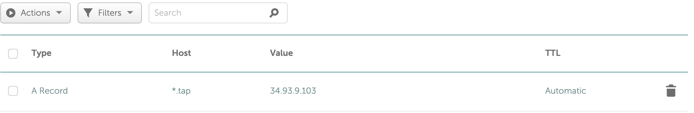

## TAP on Docker-Desktop / Google Cloud (GKE)

#### Gotchas 

- Installing TAP on Docker Desktop requires sufficient resources in CPU and memory. These installation scripts have been tested on Docker resources with 8 cpus and 16 GB of RAM.
- Installation process may be slow on Docker Desktop due to limited resources and enough time must be given to complete the installation( sometimes 10 minutes or more ). Have noticed that if there are too many applications running along with Docker then the installation is very, very slow and times out
- The container registry used for installation on Docker Desktop is Harbor. 

#### Prerequisites

In order to complete the installation, please ensure you have:

- Account created in [Tanzu Network](https://network.pivotal.io/). Information on creating a Tanzu Network account can be found [here](https://tanzu.vmware.com/developer/guides/tanzu-network-gs/#creating-a-tanzu-network-account)
- `pivnet` CLI API Token for login. Information on generating a `pivnet` token for login can be found [here](https://tanzu.vmware.com/developer/guides/tanzu-network-gs/#creating-an-api-token-for-your-user-account)

For Docker Desktop:
  - [Docker Desktop](https://www.docker.com/products/docker-desktop) installed in your local workstation. Scripts were tested on Docker Desktop v4.5.0 with Docker Engine v20.10.12
  - Kubernetes [enabled](https://docs.docker.com/desktop/kubernetes/) in Docker Desktop ( Kubernetes version v1.22.5 ).
  - Harbor container registry account. Can request for a corporate harbor account on the [Self Service Portal](https://cassi.apps.itcna.vmware.com/home). Requires VMware VPN connection
  - Create [Robot Account](https://goharbor.io/docs/1.10/working-with-projects/project-configuration/create-robot-accounts/) for Harbor container registry
  
For GCP:
  - Google Cloud Account
  - `gcloud` CLI installed and configured with project/region Refer to instructions [here](https://cloud.google.com/sdk/docs/install)
  - Create a service account in Google Cloud IAM with permission for GKE clusters, compute instance,Container registry(admin privileges for these resources). Create a key file for this service account and download it to the local system. 
  - The script creates a jump host on GCP, from where the installation is done on the GKE cluster

## Installing TAP

### Pre-Install

- Create an environment configuration file with the name`.env` at the root of the project folder using the template file `env.sample`. 

  ```shell
  $ cp .env.sample .env
  ```

- Edit the configuration file and provide all required values. Description of each variable is provided below:

| Key                         | Description                                                                                                                                                                                                                                                                                                                                                  |
|-----------------------------|--------------------------------------------------------------------------------------------------------------------------------------------------------------------------------------------------------------------------------------------------------------------------------------------------------------------------------------------------------------|
| K8_CLUSTER                  | Target K8 Cluster where TAP will be installed. Must be either `docker-desktop` or `gke`                                                                                                                                                                                                                                                                      |
| PIVNET_API_TOKEN            | API token to access the Tanzu Network account. Refer to pre-requisite section above on how to generate an API token                                                                                                                                                                                                                                          |
| TANZUNET_REGISTRY           | Static text - `registry.tanzu.vmware.com`                                                                                                                                                                                                                                                                                                                    |
| TANZUNET_USERNAME           | User name to access Tanzu Network. Refer to pre-requisite section above on how to create a Tanzu Net account                                                                                                                                                                                                                                                 |
| TANZUNET_PASSWORD           | Password to access Tanzu Network                                                                                                                                                                                                                                                                                                                             |
| CONTAINER_REGISTRY_HOSTNAME | Container registry to host the Tanzu Build Service dependencies, supply chain artefacts and workload images . Must have write access and space of 10GB.                                                                                                                                                                                                      |
| CONTAINER_REGISTRY_USERNAME | Username for the `CONTAINER_REGISTRY_HOSTNAME` container repository provided above. Note if you are using robot account for Harbor repository, it should be enclosed in single quotes to avoid unnecessary command substitution. For e.g. `CONTAINER_REGISTRY_USERNAME='robot$demo+admin'`. For Google cloud this is always `_json_key`                      |
| CONTAINER_REGISTRY_PASSWORD | Password for the `CONTAINER_REGISTRY_HOSTNAME` container repository provided above. For GKE this is the path to the Google Cloud JSON credentials file                                                                                                                                                                                                       |
| CONTAINER_REPOSITORY        | Name of the repository in the `CONTAINER_REGISTRY_HOSTNAME`. For Harbor and Google Cloud, this is the project name                                                                                                                                                                                                                                           |
| CATALOG_GUI_GIT_URL         | Path to the `catalog-info.yaml` catalog definition file. For e.g. If the catalog is hosted on Github, then the path will be the full URL of the `catalog-info.yaml` file as `https://github.com/<git_user>/<git_repo>/blob/main/catalog-info.yaml`                                                                                                           |
| INGRESS_DOMAIN              | Subdomain of your choice that is the value of the same name passed to the `tap-gui` package. via the `tap-values.yaml`. To simplify DNS for our local(Docker Desktop) installation , we set our `ingress-domain` to `127-0-0-1.nip.io`. This will automatically route requests to localhost and does not require any entries to be made to `/etc/hosts` file |
| DEVELOPER_NAMESPACE         | Kubernetes namespace which holds all resources for workload per developer                                                                                                                                                                                                                                                                                    |
| DEFAULT_WORKLOAD_NAME       | Default workload name used if not specified when creating workloads on TAP. Default value `sample-app`                                                                                                                                                                                                                                                       |
| GCP_REGION                  | Google Cloud Region where all GCP resources (GKE,Jump Host) are created                                                                                                                                                                                                                                                                                      |
| GCP_SERVICE_ACCOUNT_NAME    | Google IAM Service account with privileges for GKE, Compute, Container Registry. The key file associated with this account must be provided in `CONTAINER_REGISTRY_PASSWORD`                                                                                                                                                                                 |
        
- To be run on GCP only: Setup the Google Cloud environment by creating the GKE cluster and jump host. 

  ```shell
  ./install/configure-tap-gcp-env.sh
  ```
  This will create the GKE cluster with the name `tap-cluster` and a jump host with the name `tap-jump`. 
  copy over the service account json key to the jump host and then supply it as a path value in the environment file for CONTAINER_REGISTRY_PASSWORD
  As part of this script, the project files are also copied over to the jump host, from where the scripts can be run directly from the jump host.

- To be run on GCP only: SSH into the GCP jump host by using 

  ```shell
  gcloud compute ssh tap-jump  
  ```
  Navigate to the root of the project after logging into the jump host and run all the commands below from the jump host

### Step 0 - Configure the install environment

- Run the following command from the root of the project folder to configure the install environment

  ```shell
   ./install/00-install-tools.sh
  ```
  
  This script will download the `pivent` CLI if not installed previously and login using the `PIVNET_API_TOKEN` provided in the environment configuration file. It will also download `jq`, `curl` and `kubectl`
  A sample output is shown below where the `pivnet` CLI has been succesfully authenticated with the provided tanzu net credentials

  ```text
  Logged-in successfully
  ```

### Step 1 - Install Tanzu Cluster Essentials

- Run the following command from the root of the project folder to install Tanzu Cluster Essentials

  ```shell
   sudo ./install/01-install-tanzu-cluster-essentials.sh 
  ```

  A sample output is shown below where the Tanzu Cluster Essentials is successfully deployed.

  ```text
  3:35:50PM:  ^ Waiting for generation 2 to be observed
  3:35:50PM:  L ok: waiting on replicaset/secretgen-controller-545c98d48 (apps/v1) namespace: secretgen-controller
  3:35:50PM:  L ongoing: waiting on pod/secretgen-controller-545c98d48-tj2lx (v1) namespace: secretgen-controller
  3:35:50PM:     ^ Pending: ContainerCreating
  3:35:51PM: ok: reconcile deployment/secretgen-controller (apps/v1) namespace: secretgen-controller
  3:35:51PM: ---- applying complete [12/12 done] ----
  3:35:51PM: ---- waiting complete [12/12 done] ----  

  Succeeded  
  ```

### Step 2 - Install Tanzu CLI

- Run the following command from the root of the project folder to install Tanzu CLI

  ```shell
   sudo ./install/02-install-tanzu-cli.sh 
   ```

  A sample output is shown below which lists the Tanzu CLI plugins are installed on the platform

  ```text
  ✔  successfully installed 'all' plugin
  NAME                DESCRIPTION                                                        SCOPE       DISCOVERY  VERSION  STATUS
  login               Login to the platform                                              Standalone  default    v0.11.1  not installed
  management-cluster  Kubernetes management-cluster operations                           Standalone  default    v0.11.1  not installed
  package             Tanzu package management                                           Standalone  default    v0.11.1  installed
  pinniped-auth       Pinniped authentication operations (usually not directly invoked)  Standalone  default    v0.11.1  not installed
  secret              Tanzu secret management                                            Standalone  default    v0.11.1  installed
  services            Discover Service Types and manage Service Instances (ALPHA)        Standalone             v0.1.1   installed
  accelerator         Manage accelerators in a Kubernetes cluster                        Standalone             v1.0.1   installed
  apps                Applications on Kubernetes                                         Standalone             v0.4.1   installed
  ```  
### Step 3 - Configure Tanzu Repository

- Configure Tanzu Repository

  ```shell
   ./install/03-configure-tap-repository.sh
   ```
   A sample output is shown below where the Tanzu repository is reconciled successfully.

  ```text
  Added package repository 'tanzu-tap-repository' in namespace 'tap-install'
  \ Retrieving repository tanzu-tap-repository...
  NAME:          tanzu-tap-repository
  VERSION:       1747145
  REPOSITORY:    registry.tanzu.vmware.com/tanzu-application-platform/tap-packages
  TAG:           1.0.1
  STATUS:        Reconcile succeeded
  REASON:  
  ```  

### Step 4 - Install TAP

- Install TAP

  ```shell
   ./install/04-install-tap.sh 
  ```

   Note: This may take some time to complete the installation. You will continue to see a message as below when the reconciliation is in progress

  ```text
   / Waiting for 'PackageInstall' reconciliation for 'tap'
  | 'PackageInstall' resource install status: Reconciling
  ```

  If the TAP installation script has failed reconciliation you can see the error message as below

  ```text
  / Waiting for 'PackageInstall' reconciliation for 'tap'
  / 'PackageInstall' resource install status: Reconciling

  Please consider using 'tanzu package installed update' to update the installed package with correct settings


  Error: timed out waiting for the condition
  Error: exit status 1

  ✖  exit status 1
  ```

  The reconciliation process continues in the background without any user interaction. You could verify the status of the package reconciliation as described in the next step.

### Step 5 - Verify TAP Installation

- Verify TAP installation

  ```shell
   ./install/05-verify-tap-install.sh
  ```

  A sample output is shown below where some of the TAP packages have failed reconciliation

  ```text
  NAME                      PACKAGE-NAME                                  PACKAGE-VERSION  STATUS
  accelerator               accelerator.apps.tanzu.vmware.com             1.0.1            Reconcile succeeded
  appliveview               run.appliveview.tanzu.vmware.com              1.0.2-build.2    Reconcile succeeded
  appliveview-conventions   build.appliveview.tanzu.vmware.com            1.0.2-build.2    Reconcile failed: Error (see .status.usefulErrorMessage for details)
  buildservice              buildservice.tanzu.vmware.com                 1.4.2            Reconcile succeeded
  cartographer              cartographer.tanzu.vmware.com                 0.2.1            Reconcile succeeded
  cert-manager              cert-manager.tanzu.vmware.com                 1.5.3+tap.1      Reconcile succeeded
  cnrs                      cnrs.tanzu.vmware.com                         1.1.0            Reconcile failed: Error (see .status.usefulErrorMessage for details)
  ``` 

  You can further look at the error message for each package failure by running the below command and providing the package name which has failed reconciliation as an argument

  ```shell
   ./install/05-verify-tap-install.sh cnrs
  ```
  The below sample shows the installation details for the package `cnrs`

  ```text
   |  Retrieving installation details for cnrs...
  NAME:                    cnrs
  PACKAGE-NAME:            cnrs.tanzu.vmware.com
  PACKAGE-VERSION:         1.1.0
  STATUS:                  Reconcile failed: Error (see .status.usefulErrorMessage for details)
  CONDITIONS:              [{ReconcileFailed True  Error (see .status.usefulErrorMessage for details)}]
  USEFUL-ERROR-MESSAGE:    kapp: Error: waiting on reconcile deployment/imc-dispatcher (apps/v1) namespace: knative-eventing:
  Finished unsuccessfully (Deployment is not progressing: ProgressDeadlineExceeded (message: ReplicaSet "imc-dispatcher-5987767d76" has timed out progressing.))
  ```

  The package reconciliation failure could be because of client-side throttling of Kubernetes. You can continue to wait until all packages have been reconciled successfully
  
  A sample output is shown below where the TAP packages have been reconciled successfully.  

  ```text
  | Retrieving installed packages...
  NAME                      PACKAGE-NAME                                  PACKAGE-VERSION  STATUS
  accelerator               accelerator.apps.tanzu.vmware.com             1.0.1            Reconcile succeeded
  appliveview               run.appliveview.tanzu.vmware.com              1.0.2-build.2    Reconcile succeeded
  appliveview-conventions   build.appliveview.tanzu.vmware.com            1.0.2-build.2    Reconcile succeeded
  buildservice              buildservice.tanzu.vmware.com                 1.4.2            Reconcile succeeded
  cartographer              cartographer.tanzu.vmware.com                 0.2.1            Reconcile succeeded
  cert-manager              cert-manager.tanzu.vmware.com                 1.5.3+tap.1      Reconcile succeeded
  cnrs                      cnrs.tanzu.vmware.com                         1.1.0            Reconcile succeeded
  contour                   contour.tanzu.vmware.com                      1.18.2+tap.1     Reconcile succeeded
  conventions-controller    controller.conventions.apps.tanzu.vmware.com  0.5.0            Reconcile succeeded
  developer-conventions     developer-conventions.tanzu.vmware.com        0.5.0            Reconcile succeeded
  fluxcd-source-controller  fluxcd.source.controller.tanzu.vmware.com     0.16.1           Reconcile succeeded
  ootb-delivery-basic       ootb-delivery-basic.tanzu.vmware.com          0.6.1            Reconcile succeeded
  ootb-supply-chain-basic   ootb-supply-chain-basic.tanzu.vmware.com      0.6.1            Reconcile succeeded
  ootb-templates            ootb-templates.tanzu.vmware.com               0.6.1            Reconcile succeeded
  service-bindings          service-bindings.labs.vmware.com              0.6.0            Reconcile succeeded
  services-toolkit          services-toolkit.tanzu.vmware.com             0.5.0            Reconcile succeeded
  source-controller         controller.source.apps.tanzu.vmware.com       0.2.0            Reconcile succeeded
  spring-boot-conventions   spring-boot-conventions.tanzu.vmware.com      0.3.0            Reconcile succeeded
  tap                       tap.tanzu.vmware.com                          1.0.1            Reconcile succeeded
  tap-gui                   tap-gui.tanzu.vmware.com                      1.0.2            Reconcile succeeded
  tap-telemetry             tap-telemetry.tanzu.vmware.com                0.1.3            Reconcile succeeded
  tekton-pipelines          tekton.tanzu.vmware.com                       0.30.0           Reconcile succeeded
  ```
  After all packages have been reconciled succesfully, you can deploy workloads using TAP. Refer to the workload documentation in this project

## Troubleshooting

### Manual reconciliation of package

- In case you need to manually start reconciliation of a package that has failed:

  ```shell
  ./install/06-manual-tap-reconciliation.sh
  ```

### Updating Tanzu package after changing tap-values.yaml

- In case of any changes to the `tap-values.yaml`, you can re-apply the configuration by using:

  ```shell
  ./install/07-update-tap-install.sh
  ```

## Running Workloads on TAP

### Step 1 - Setup Dev namespace

-  Setup Developer workspace

  ```shell
  ./workloads/01-setup-dev-namespace.sh
  ```
  This script will create a separate namespace for the developer to run workloads using the name DEVELOPER_NAMESPACE
  defined in the environment configuration. It also configures the RBAC, secrets to deploy workloads

  A sample partial output is shown below where the Developer namespace and RBAC is created successfully.

  ```text
  secret/tap-registry created
  serviceaccount/default configured
  role.rbac.authorization.k8s.io/default created
  rolebinding.rbac.authorization.k8s.io/default created
  ```

### Step 2 - Create workload

- Create workload

  ```shell
  ./workloads/02-workload-create.sh sample-app
  ```

  Note: The argument provided above to the script is the name of the workload. 

  The following output is generated which also contains the workload yaml.

  ```text
  + tanzu apps workload create sample-app --git-repo https://github.com/sample-accelerators/tanzu-java-web-app --git-branch main --type web --label app.kubernetes.io/part-of=sample-app --namespace dev1 --yes
  Create workload:
        1 + |---
        2 + |apiVersion: carto.run/v1alpha1
        3 + |kind: Workload
        4 + |metadata:
        5 + |  labels:
        6 + |    app.kubernetes.io/part-of: sample-app
        7 + |    apps.tanzu.vmware.com/workload-type: web
        8 + |  name: sample-app
        9 + |  namespace: dev1
      10 + |spec:
      11 + |  source:
      12 + |    git:
      13 + |      ref:
      14 + |        branch: main
      15 + |      url: https://github.com/sample-accelerators/tanzu-java-web-app

  Created workload "sample-app"
  ```

This should take a very long time on Docker Desktop due to limited resource capacity (sometimes over 10 mins)


### Step 3 - Check status of workload

  - Tail the logs generated by the workload 

    ```shell
    ./workloads/03-workload-tail.sh sample-app
    ```
    Note: The argument provided below to the script is the name of the workload that is used in the above step.

    The output from the command will display all the current tasks that are being run as part of the supply chain
  
  - Check the status of the workload

    ```shell
    ./workloads/04-workload-status.sh sample-app
    ```

    ```text
    lastTransitionTime: "2022-02-23T05:07:26Z"
    message: ""
    reason: Ready
    status: "True"
    type: Ready

    Workload pods
    NAME                                 STATUS      RESTARTS   AGE
    sample-app-build-1-build-pod         Succeeded   0          13m
    sample-app-config-writer-px56g-pod   Succeeded   0          6m48s

    Workload Knative Services
    NAME         READY   URL
    sample-app   Ready   http://sample-app.dev1.tap.ahmedmq.co.in
    ```
 
    Notice the status of the `sample-app` is 'Ready' and the URL of the workload which is formed of
    the DEFAULT_WORKLOAD_NAME, DEVELOPER_NAMESPACE and INGRESS_DOMAIN defined in the configuration file


### Step 4 - Test workload 

  - Configure DNS to route traffic to the envoy load balancer. This needs to be done for GCP only, for Docker-desktop we have configured the `127-0-0-1.nip.io` domain

    Obtain the external IP of the envoy load balancer

    ```
     kubectl get service envoy -n tanzu-system-ingress
    ```
    
    ```text
    NAME    TYPE           CLUSTER-IP    EXTERNAL-IP     PORT(S)                      AGE
    envoy   LoadBalancer   10.24.5.113   34.100.181.55   80:31593/TCP,443:31440/TCP   46m
    ```
    
  - Create a wildcard DNS record for the domain you have provided in the environment configuration(INGRESS_DOMAIN). A sample is shown below
  
    


  - Run command to `curl` to the workload url and check the response

    ```shell
    ./workloads/05-workload-test.sh sample-app
    ```

    Below is a sample output from the `curl` command to the workload url, which executes every 2 seconds. 

    ```text
    Greetings from Spring Boot + Tanzu!
    Greetings from Spring Boot + Tanzu!
    Greetings from Spring Boot + Tanzu!
    Greetings from Spring Boot + Tanzu!
    Greetings from Spring Boot + Tanzu!
    ```
    The URL of the workload can be been seen in the output of the workload status command in the previous step.
    Alternatively, you can open the browser and enter the URL to access the workload
  
### Step 5 - Delete workload

- After completing the above steps, you can clean up by deleting the workload

  ```shell
    ./workloads/06-workload-delete.sh
  ```
  A sample output below shows the workload is successfully deleted

  ```text
  + tanzu apps workload delete sample-app --namespace dev1 --yes
  Deleted workload "sample-app" 
  ```
    
  The namespace and workload name in the above output is picked up from DEVELOPER_NAMESPACE 
  and DEFAULT_WORKLOAD_NAME defined in the environment configuration file
  
## Uninstall TAP

- Finally, we can clean up the whole TAP installation by running the following command. 
  Note, alternatively the quicker way is deleting the cluster or resetting Kubernetes in Docker desktop and then executing this step. 
  
  ```shell
    sudo ./install/08-uninstall-all.sh
  ```

  This will take a long time to complete, during which it will remove all the TAP packages, repositories
  Tanzu Cluster Essentials, CLI and any temporary directories.

- Delete the jump host . Export the GCP_REGION variable

  ```shell
  GCP_REGION=<<<value>>>
  CLUSTER_ZONE="$GCP_REGION-a"
  gcloud compute instances delete tap-jump -q --zone="$CLUSTER_ZONE"
  ```